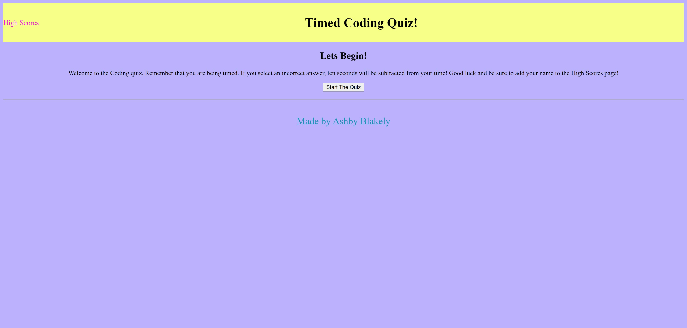

# Coding Quiz
 
[Link to LIVE site.](https://ashbylb.github.io/student-code-quiz/)

## Table of Contents
- [Description](#Description)
- [Usage](#Usage)
- [Screenshot](#Screenshot)
- [Languages](#Languages)

## Discription
Welcome to my Coding Quiz!  I  hope I have not made it too hard for you!  Feel free to click the "Start the Quiz" button to begin!
Be sure and add your name to the High Scores page then you are done!  

## Usage 
To begin, select the "Start the Quiz" button.  A series of questions and multiple choice answers will apear.  Be sure and watch the time!  If you get one wrong it will take off ten seconds!

## Screenshot
 

## Languages
HTML, CSS, and JavaScript